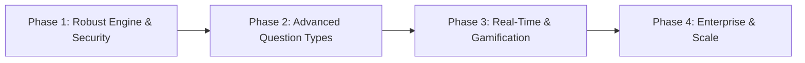

# 🧠 QUIMORA — AI AGENT & DEVELOPER MASTER BLUEPRINT
> **Single Source of Truth** for current progress, technical debt, future roadmap, and strict engineering standards to elevate Quimora to a production-grade enterprise platform.
>
> 📌 **Documentation Framework (docs/):**
> - 🗺️ **Master Roadmap**: [`docs/MASTER_ROADMAP.md`](file:///d:/quimora/docs/MASTER_ROADMAP.md)
> - 📐 **System Architecture**: [`docs/ARCHITECTURE.md`](file:///d:/quimora/docs/ARCHITECTURE.md)
> - 🔌 **API Reference**: [`docs/API_REFERENCE.md`](file:///d:/quimora/docs/API_REFERENCE.md)
> - 🗄️ **Data Models**: [`docs/DATA_MODEL.md`](file:///d:/quimora/docs/DATA_MODEL.md)
> - ⚖️ **Business Decisions**: [`docs/DECISIONS.md`](file:///d:/quimora/docs/DECISIONS.md)
> - 🤖 **AI Delegation SOP**: [`docs/AI_DELEGATION_GUIDE.md`](file:///d:/quimora/docs/AI_DELEGATION_GUIDE.md)

---

## 📑 TABLE OF CONTENTS
1. [Project Overview & Core Architecture](#1-project-overview--core-architecture)
2. [Adha Adhura Kissa (Current State & Progress Tracker)](#2-adha-adhura-kissa-current-state--progress-tracker)
3. [Next-Level Development Roadmap](#3-next-level-development-roadmap)
4. [Strict Rules & Engineering Regulations](#4-strict-rules--engineering-regulations)
   - [Backend Standards & API Design](#41-backend-standards--api-design)
   - [Frontend Architecture & UI/UX Standards](#42-frontend-architecture--uiux-standards)
   - [Security & Authentication Protocols](#43-security--authentication-protocols)
   - [Database & Mongoose Best Practices](#44-database--mongoose-best-practices)
5. [Git Workflow & Coding Discipline](#5-git-workflow--coding-discipline)
6. [Live Deployment & Production Go-Live Checklist](#6-live-deployment--production-go-live-checklist)
7. [Agent Handover & Prompting Directives](#7-agent-handover--prompting-directives)

---

## 1. 🌐 PROJECT OVERVIEW & CORE ARCHITECTURE

**Quimora** is an end-to-end, high-performance Quiz & Assessment Management Platform featuring Role-Based Access Control (Admin, Instructor, Student/User), dynamic quiz generation, real-time assessment engine, automated scoring, and detailed performance analytics.

### 🛠️ Technology Stack

```
                     ┌────────────────────────────────────────┐
                     │          QUIMORA ARCHITECTURE          │
                     └────────────────────────────────────────┘
                                          │
            ┌─────────────────────────────┴─────────────────────────────┐
            ▼                                                           ▼
┌───────────────────────────────┐                           ┌───────────────────────────────┐
│       FRONTEND (CLIENT)       │                           │       BACKEND (SERVER)        │
├───────────────────────────────┤                           ├───────────────────────────────┤
│ • React 19 + Vite 8           │                           │ • Node.js (ES Modules)        │
│ • Tailwind CSS v4             │                           │ • Express.js 5.x              │
│ • Zustand (Global State)      │                           │ • MongoDB + Mongoose 9.x      │
│ • React Router Dom v7/v8      │                           │ • JWT Auth + Bcrypt Hashing   │
│ • Recharts (Data Viz)         │                           │ • Nodemailer (OTP Mailer)     │
│ • Lucide React + Motion       │                           │ • ImageKit SDK (Media Upload) │
│ • Axios Interceptors          │                           │ • Morgan + Express Rate Limit │
└───────────────────────────────┘                           └───────────────────────────────┘
```

---

## 2. 📖 ADHA ADHURA KISSA (GROUND TRUTH CODEBASE STATUS)

### ✅ What is Completed (Finished, Built & Stable)
- [x] **Monorepo & Foundation**: Monorepo split with dedicated `backend/` and `frontend/` folders.
- [x] **Authentication & Role Authorization**:
  - Registration with password hashing (Bcrypt).
  - Login with JWT generation and Bearer token headers.
  - Role verification middleware (`admin`, `instructor`, `user`/`student`).
  - Forgot Password flow via secure **Email OTP** (Nodemailer, 6-digit code, 10-min expiration).
- [x] **Core Database Models**:
  - `User`, `Quiz`, `Question`, `QuizAttempt` schemas fully wired with Mongoose.
- [x] **Frontend Architecture & Theme System**:
  - Vite 8 + React 19 setup with Tailwind CSS v4 styling.
  - Dark/Light mode theme system (`useTheme.js` hook + 18 responsive component files).
  - Protected Routes, Public Routes, Guest Routes, and RBAC layout guards.
  - Zustand global state stores (`authStore.js`, `useStudentQuizStore.js`, `useAdminStore.js`).
- [x] **Anti-Cheating & Proctoring Safeguards Suite**:
  - `useExamProctoring.js` hook + `FullscreenLockOverlay.jsx` modal overlay.
  - Strict fullscreen lock enforcement (blocks progress if student exits fullscreen).
  - Tab-switch tracking (`visibilitychange` API) with dynamic warning count increment.
  - Copy-paste blocking, context menu disabled, and devtools shortcut warning alerts.
- [x] **Server-Validated Timed Quiz Engine (V2 P0)**:
  - Real-time client & server timestamp calculation (`startedAt`, `remainingTimeSeconds`).
  - 15-second server grace buffer (`handleExpiredAttempt`) before auto-marking attempts as `'abandoned'`.
  - Student pre-quiz eligibility check endpoint (`GET /api/v1/student/quiz/:quizId/eligibility`) verifying max attempt limits and active sessions.
- [x] **Leaderboard & Student Analytics Engine**:
  - Backend aggregation service (`studentDashboard.service.js`) for per-quiz and global rankings.
  - Frontend ranking list components (`LeaderboardItem.jsx`) and student history tracking.
- [x] **Groq AI Integration Suite**:
  - AI Question generator (`POST /api/v1/instructor/ai/generate-questions`) powered by Groq SDK.
  - AI Quiz Description generator (`POST /api/v1/instructor/ai/generate-description`).
- [x] **Instructor Suite (Core, Analytics & CSV Tooling)**:
  - Dynamic live attempt counts calculated via `QuizAttempt` aggregations.
  - Correct answer option sanitization (student payload sanitized, instructor receives `isCorrect`).
  - Bulk Question Importer (`BulkImportModal.jsx`): CSV & JSON template import with live validation preview.
  - Student Submissions inspection, answer sheet review, and **"Export CSV"** marks sheet download.
  - Student Roster page (`/instructor/students`) with search, filter, and CSV export.
  - Visual Graphical Analytics on Instructor Dashboard (`InstructorAnalyticsChart.jsx`) with 7-Day area charts and bar charts.
- [x] **Admin Control Suite (V2 P1)**:
  - Platform overview metrics (total users, active quizzes, overall pass rates).
  - User role elevation (`user` ↔ `instructor` ↔ `admin`) with last-admin protection safeguards.
  - User account suspension toggle (`PATCH /api/v1/users/:userId/active`).
- [x] **Media & Image Uploads (V2 P1)**:
  - Question diagram attachments & User profile avatar uploads via ImageKit SDK (`/quimora/questions` & `/quimora/profile`).
- [x] **Automated Test Suite**:
  - 28 Vitest integration test cases across 4 modules (`01_authentication`, `02_student_role`, `03_instructor_role`, `04_admin_role`).
  - Frontend Vitest suite executed cleanly (`npm run test`).

---

### ⚠️ What is In Progress / Next Up (V3 Scope)
- [ ] **1-Click Quiz Clone / Duplication**: Instructor 1-click clone action (duplicating quiz schema + question array with modified title).
- [ ] **Question Bank Library**: Tagged shared question pool reusable across multiple quizzes.
- [ ] **Adaptive Difficulty Engine**: Real-time adjustment of question difficulty based on student accuracy.
- [ ] **Automated Certificate Generation**: PDF completion certificates issued upon achieving passing score with QR verification.

---

### ❌ What is Genuinely Pending Infrastructure & Polish
- [ ] **Security Hardening**: `helmet()` middleware application on Express `server.js`.
- [ ] **Docker & CI/CD**: `Dockerfile`, `docker-compose.yml`, and GitHub Actions deployment workflows (`.github/workflows/`).
- [ ] **Database Index Optimization**: Full audit of Mongoose schema indexes for high-concurrency read queries.
- [ ] **Redis Caching**: Redis layer for leaderboard queries and read-heavy quiz payloads.

---

## 3. 🚀 NEXT-LEVEL DEVELOPMENT ROADMAP



### Phase 1: Robust Engine, Security & Polish (Immediate Focus)
1. **Server-Validated Timer**: Store attempt start time in MongoDB; calculate elapsed time on submit to reject delayed payloads.
2. **Anti-Cheating Safeguards**:
   - Track tab switch count (`visibilitychange` API) and auto-flag/auto-submit after threshold.
   - Prevent copy-paste on question screen.
3. **Question Randomization**: Option to shuffle questions and options per student attempt.
4. **Negative Marking**: Configurable negative score penalty per wrong response.

### Phase 2: Advanced Question Formats & Question Bank
1. **Diverse Question Types**:
   - Multiple Choice (Single answer)
   - Multi-Select (Checkbox multiple answers)
   - True/False
   - Fill-in-the-blanks
   - Short Answer with keyword scoring
2. **Central Question Bank**: Instructors can tag, reuse, and import questions (CSV / JSON format).
3. **Rich Text / MathJax / Code Blocks**: Code snippet rendering with syntax highlighting and LaTeX math equations in questions.

### Phase 3: Analytics, Gamification & Certification
1. **Leaderboards**: Daily, weekly, and all-time leaderboards per quiz and globally.
2. **Automated Certificates**: Generate high-res downloadable PDF certificates with verification QR codes.
3. **Deep Student Insights**: Strength/weakness radar charts by subject category.

### Phase 4: Enterprise Scale & Monetization
1. **Batch / Classroom System**: Group students into classrooms/batches with assigned quizzes and deadlines.
2. **Monetized / Paid Quizzes**: Razorpay / Stripe integration for premium test series.
3. **High-Concurrency Architecture**: Redis caching for read-heavy quiz retrieval and background queue processing.

---

## 4. 📜 STRICT RULES & ENGINEERING REGULATIONS

### 4.1 Backend Standards & API Design
- **Architecture Flow**: Always adhere to `Route -> Middleware -> Controller -> Service -> Model`. Do NOT place business logic directly in route files.
- **Consistent Response Format**: Every API response must adhere to:
  ```json
  // Success Response
  {
    "success": true,
    "message": "Quiz fetched successfully",
    "data": { ... }
  }

  // Error Response
  {
    "success": false,
    "message": "Invalid credentials or unauthorized access",
    "error": "Error details or validation array"
  }
  ```
- **Error Handling**: Use `try-catch` blocks or `asyncHandler` wrappers. Never let unhandled promise rejections crash the Node process.
- **Status Codes**:
  - `200 OK` (Standard success)
  - `201 Created` (Resource created)
  - `400 Bad Request` (Validation error)
  - `401 Unauthorized` (Missing / invalid token)
  - `403 Forbidden` (Insufficient role/permissions)
  - `404 Not Found` (Resource does not exist)
  - `429 Too Many Requests` (Rate limit reached)
  - `500 Internal Server Error` (Unexpected server error)
- **Input Validation**: Validate all incoming `req.body`, `req.params`, and `req.query` before querying the database.

---

### 4.2 Frontend Architecture & UI/UX Standards
- **Design Philosophy**:
  - Sleek, modern, and uncluttered.
  - Vibrant accent colors with consistent dark/light backgrounds.
  - Smooth micro-interactions, subtle glassmorphism, and responsive padding.
  - No broken layouts on mobile screen sizes (360px+).
- **Component Cleanliness & Design System**:
  - Avoid 800+ line monolithic components. Split complex pages into reusable sub-components (`components/`).
  - **Unified StatCard Standard**: Always use `src/components/common/StatCard.jsx` and `src/components/common/StatsGrid.jsx` for all dashboard and page KPI metric cards. Never create custom ad-hoc stats card divs.
  - Use custom hooks for complex business logic.
- **State Management (Zustand)**:
  - Keep auth state synchronized in `authStore.js`.
  - Store active quiz state in a dedicated store to prevent lost answers on refresh.
- **Axios Interceptors**:
  - Automatically attach Bearer tokens from storage to outgoing requests.
  - Handle global `401 Unauthorized` responses by wiping invalid tokens and redirecting to `/login`.

---

### 4.3 Security & Authentication Protocols
1. **Password Policy**: Minimum 8 characters, hashed with Bcrypt (salt rounds $\ge$ 10). Never return passwords in API responses (use `.select("-password")`).
2. **JWT Security**: Store JWT in `httpOnly` secure cookies or secure bearer headers. Validate signature on every protected route.
3. **CORS Configuration**: Restrict CORS origins in production (`process.env.CLIENT_URL`). Do not leave `*` wildcard in production.
4. **Rate Limiting**: Apply strict rate limiting on `/api/auth/login`, `/api/auth/register`, and `/api/auth/forgot-password`.
5. **NoSQL Injection & Sanitization**: Sanitize user inputs to prevent MongoDB operator injection (`$gt`, `$ne`, etc.).

---

### 4.4 Database & Mongoose Best Practices
- **Indexing**: Always index frequently queried fields (`userId`, `quizId`, `email`, `role`, `createdAt`).
- **Lean Queries**: Use `.lean()` on read-only queries for significantly higher throughput and lower memory footprint.
- **Soft Deletes**: Use `isDeleted: { type: Boolean, default: false }` for critical entities (Quizzes, Users) rather than hard deletions where audit trails are required.
- **Atomic Operations**: Use `$inc`, `$push`, `$set` rather than loading entire documents, modifying in memory, and calling `.save()` to prevent race conditions.

---

## 5. 🌿 GIT WORKFLOW & CODING DISCIPLINE

### ⛔ STRICT PROHIBITION FOR AI ASSISTANTS (NO AUTOMATED GIT PUSH)
> 🚨 **CRITICAL MANDATE:**
> **The AI assistant MUST NEVER execute `git push` to remote repositories.**
> AI is permitted to stage (`git add`) and commit (`git commit`) locally ONLY when explicitly requested.
> Pushing code to remote (`git push origin <branch>`) MUST ALWAYS be performed manually by the human developer/user.

### Branching Strategy
- `main` : Production-ready code only.
- `dev` : Active integration branch.
- `feature/<feature-name>` : Individual feature development.
- `fix/<bug-name>` : Bug fixes and hotfixes.

### Commit Message Format (Conventional Commits)
- `feat:` New feature added (e.g., `feat(quiz): add timer auto-submit mechanism`)
- `fix:` Bug fix (e.g., `fix(auth): prevent OTP reuse after verification`)
- `refactor:` Code restructuring without feature change
- `docs:` Documentation changes
- `chore:` Dependency updates or build tooling adjustments

---

## 6. 🌐 LIVE DEPLOYMENT & PRODUCTION GO-LIVE CHECKLIST

Before deploying Quimora to a live environment (e.g., Render, Railway, Vercel, AWS, DigitalOcean):

### Environment Variables Checklist

#### Backend (`backend/.env`):
```env
NODE_ENV=production
PORT=5000
MONGO_URI=mongodb+srv://<user>:<password>@cluster.mongodb.net/quimora?retryWrites=true&w=majority
JWT_SECRET=super_strong_random_jwt_secret_key_min_64_chars
JWT_EXPIRE=7d
CLIENT_URL=https://quimora.yourdomain.com
EMAIL_HOST=smtp.gmail.com
EMAIL_PORT=465
EMAIL_USER=your_email@gmail.com
EMAIL_PASS=your_app_password
IMAGEKIT_PUBLIC_KEY=your_imagekit_public_key
IMAGEKIT_PRIVATE_KEY=your_imagekit_private_key
IMAGEKIT_URL_ENDPOINT=https://ik.imagekit.io/your_id
```

#### Frontend (`frontend/.env`):
```env
VITE_API_BASE_URL=https://api.quimora.yourdomain.com/api
```

### Production Checklist
- [ ] **Database Connection**: MongoDB Atlas configured with IP access list and auto-scaling connection pools.
- [ ] **Console Logs**: Remove or suppress development `console.log` statements in production bundles.
- [ ] **Security Headers**: Enable `helmet()` middleware on Express server.
- [ ] **Build Validation**: Run `npm run build` in `frontend/` without errors or bundle warnings.
- [ ] **Health Check Route**: Ensure `/api/health` returns `200 OK` for load balancer monitoring.
- [ ] **SSL / HTTPS**: Enforce HTTPS on both API and Client domains.

---

## 7. 🤖 AGENT HANDOVER & PROMPTING DIRECTIVES

> **Instruction for AI Agents & Collaborators:**
> When asked to work on any feature or bug in Quimora:
> 1. Read this `agent/agent.md` file first to understand project context and constraints.
> 2. Always follow the response formats, security protocols, and folder structure described in Section 4.
> 3. After completing tasks, update the **Adha Adhura Kissa** section in this file to reflect the new state.
> 4. Ensure no regression in existing Auth, Role-based routing, or Quiz submission flows.

---
*Created with ❤️ for Quimora Engineering Team | Keep Building, Keep Scaling!*
