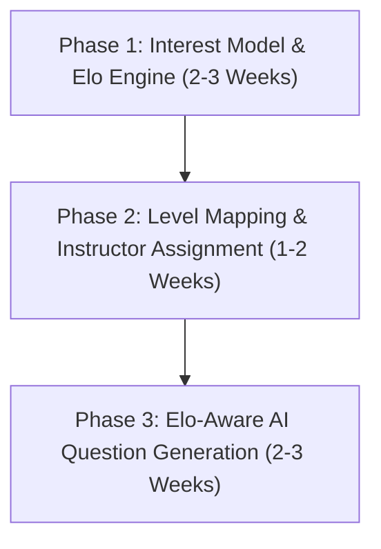

# Quimora — V3 Execution Plan (Adaptive & Interest-Driven Engine)

> **Document Type:** V3 Specific Implementation Plan & Scope  
> **Status:** Active Target (Pending Code Start)  
> **Target Timeline:** 5-8 Weeks  
> **Last Updated:** 2026-09-28  

---

## 🎯 Goal
Build an **Interest-Driven Adaptive Assessment Engine** for Quimora that dynamically tailors quiz experiences to student skill levels via Elo ratings, maps skill progression to clear performance tiers, enforces explicit instructor assignments with student consent, and provides privacy-preserving analytics.

---

## 🗄️ Data Model Specifications
All V3 Mongoose schema specifications (`Interest`, `EloRating`, `Level`, `InstructorProfile`, `QuizAssignment`) are documented in **[`docs/DATA_MODEL.md`](file:///d:/quimora/docs/DATA_MODEL.md)**.

---

## 🌟 Core V3 Features

1. **Interest Selection & Quiz Filtering**:
   - Students pick topic interests/tags upon onboarding or profile customization.
   - Quiz catalog dynamically filters and highlights quizzes aligned with chosen interests.
   - Voluntary attempt flow without forced enrollment.

2. **Elo-Based Adaptive Difficulty Engine**:
   - Dynamic Elo rating formula calculated per student interest domain ($K = 32$).
   - Correct responses elevate student Elo and lower question difficulty; incorrect responses lower student Elo and elevate question difficulty.

3. **Level Mapping (Beginner → Expert)**:
   - Automated rank classification based on fixed Elo score thresholds:
     - **Beginner**: $0 - 1000$ Elo
     - **Learner**: $1000 - 1200$ Elo
     - **Intermediate**: $1200 - 1400$ Elo
     - **Advanced**: $1400 - 1600$ Elo
     - **Master**: $1600 - 1800$ Elo
     - **Expert**: $1800+$ Elo

4. **Instructor Assignment (1 Quiz = 1 Instructor)**:
   - Strict assignment mapping where each quiz is linked to one primary instructor via `QuizAssignment`.
   - Instructors manage multiple quizzes while maintaining clean ownership boundaries.

5. **Student Consent & Instructor Transparency**:
   - Pre-quiz modal displays instructor name, bio, expertise, and rating.
   - Student explicitly consents before initiating the quiz attempt (`POST /api/v1/student/quiz/:quizId/consent`).

6. **Privacy-Preserving Instructor Visibility**:
   - Instructors access full detailed breakdown (student names, answers, attempt metrics) for their assigned quizzes.
   - Cross-instructor quiz metrics display anonymized aggregate statistics only to protect student privacy.

---

## 📅 Implementation Phases

### Phase 1: Interest Model & Elo Engine (2–3 Weeks) — Pending Code Start
- Implement `Interest` and `EloRating` Mongoose schemas and API endpoints.
- Build backend Elo calculation service (`EloEngineService`) triggered upon quiz attempt completion.
- Implement interest tag selection UI on student dashboard and quiz filter bar.

### Phase 2: Level Mapping & Instructor Assignment (1–2 Weeks)
- Implement `Level`, `InstructorProfile`, and `QuizAssignment` schemas.
- Build Level tier badge component and student rank progress card.
- Build pre-quiz consent modal showing instructor credentials.
- Enforce instructor data isolation middleware (`scopeInstructorAnalytics`).

### Phase 3: AI Question Generation (Elo-Aware) (2–3 Weeks)
- Extend Groq AI service to accept student Elo level / target difficulty tier.
- Generate calibrated questions suited to target Elo bands.
- End-to-end integration testing with Vitest suite (`05_v3_adaptive_engine.test.js`).

---

## 🚫 Out of Scope for V3
The following items belong to future releases and are explicitly excluded from V3 planning:
- Native Mobile Application (React Native)
- Advanced AI Video/Webcam Proctoring
- Enterprise Multi-Tenancy & Workspace Isolation

---

## 🔮 Future Note
> *Future is bright. Once V3 is reached, V4/V5 will be planned. For now, focus on V3.*
